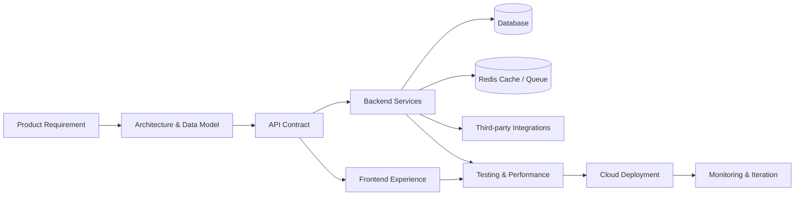
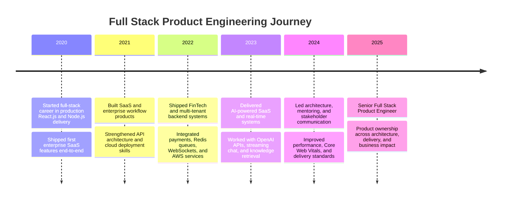

<div align="center">


<a href="https://git.io/typing-svg">
  
</a>

<br />


</div>

---

## `whoami`

```ts
type Engineer = {
  name: "Mahesh Trapasiya";
  role: "Senior Full Stack Product Engineer";
  experience: "6.4+ years";
  location: "Ahmedabad, Gujarat, India";
  specialty: [
    "Full-stack product ownership",
    "Multi-tenant SaaS architecture",
    "AI-powered workflows",
    "High-throughput APIs",
    "Cloud deployment",
    "Performance optimization"
  ];
  currentStack: ["React.js", "Next.js", "Node.js", "TypeScript", "MySQL", "MongoDB", "Redis", "AWS"];
};
```

I build **production-grade web platforms** end-to-end: from requirements, system architecture, database design, API contracts, and cloud deployment to polished React/Next.js user experiences. My work spans **HealthTech, FinTech, EdTech, TravelTech, EnergyTech, AI SaaS, and enterprise workflow automation**.

---

## Engineering cockpit

<div align="center">

<table>
  <tr>
    <td align="center" width="33%">
      <br/><br/>
      <b>Product Engineering</b><br/>
      <p>Requirements → architecture → implementation → deployment → iteration.</p>
    </td>
    <td align="center" width="33%">
      <br/><br/>
      <b>AI Systems</b><br/>
      <p>LLM APIs, document ingestion, retrieval pipelines, streaming chat, agents.</p>
    </td>
    <td align="center" width="33%">
      <br/><br/>
      <b>Scalable SaaS</b><br/>
      <p>Multi-tenant backends, RBAC, Redis queues, WebSockets, cloud-native delivery.</p>
    </td>
  </tr>
</table>

</div>

---

## Tech arsenal

<div align="center">

### Frontend


### Backend + APIs


### Databases


### Cloud + DevOps


### Workflow


</div>

---

## System design DNA



---

## What I optimize for

<table>
  <tr>
    <td><b>⚙️ Architecture</b></td>
    <td>Clean boundaries, modular services, scalable data models, API-first contracts, maintainable product structure.</td>
  </tr>
  <tr>
    <td><b>🚀 Performance</b></td>
    <td>Redis caching, query optimization, bundle reduction, SSR/SSG strategy, Core Web Vitals improvements.</td>
  </tr>
  <tr>
    <td><b>🔐 Security</b></td>
    <td>JWT, OAuth 2.0, RBAC, tenant isolation, MFA, Cognito, secure third-party integrations.</td>
  </tr>
  <tr>
    <td><b>💡 Realtime</b></td>
    <td>WebSockets, Socket.IO, streaming AI responses, push notifications, live dashboards.</td>
  </tr>
  <tr>
    <td><b>🧑‍💻 Developer Experience</b></td>
    <td>Reusable components, Axios patterns, linting, formatting, testing, code reviews, pair programming.</td>
  </tr>
</table>

---

## GitHub telemetry

<div align="center">


</div>

---

## Career timeline



---

## Currently exploring

<div align="center">


</div>

---

## Contact terminal

```bash
npx connect-with-mahesh --role "Senior Full Stack Product Engineer" --stack "React Next Node TypeScript"
```

<div align="center">

<a href="mailto:maheshtrapasiya7498@gmail.com">
  
</a>
<a href="https://www.linkedin.com/in/maheshtrapasiya">
  
</a>
<a href="https://github.com/maheshtrapasiya">
  
</a>

</div>

---

<div align="center">


### "I do not just ship features. I build systems that survive production."

</div>
